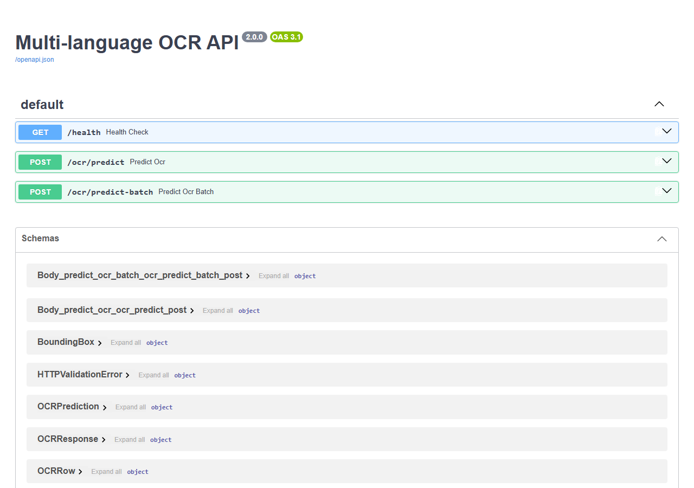
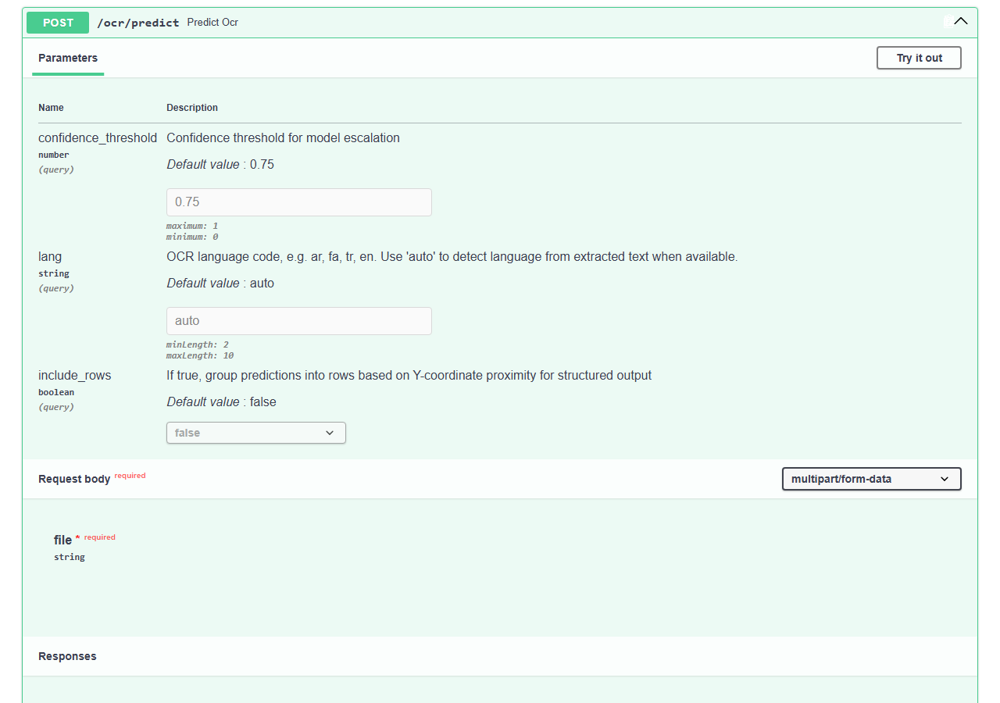

# Multi-language OCR API

[](https://www.python.org/downloads/)
[](https://fastapi.tiangolo.com/)
[](https://github.com/PaddlePaddle/PaddleOCR)
[](LICENSE)
[](https://github.com/g-j4mb/multi-language-ocr-api/actions/workflows/ci-cd.yml)

A FastAPI service that runs [PaddleOCR](https://github.com/PaddlePaddle/PaddleOCR) over images, PDFs, and Word documents and returns structured, per-word text predictions. It uses a two-tier model escalation strategy — a fast mobile model first, then a larger model only when the fast pass looks unreliable — and includes an Arabic-specialized recognition path alongside general multi-language support.

## Screenshots

| Swagger UI (`/docs`) | `POST /ocr/predict` detail |
|---|---|
|  |  |

Both screenshots are from the service actually running locally (`uvicorn api:app`), showing the real registered endpoints and the `/ocr/predict` request/response schema as served by FastAPI's auto-generated OpenAPI docs.

## Features

- **Multi-format ingestion**: images (PNG/JPG/JPEG/BMP/TIFF), PDFs (rendered page-by-page via PyMuPDF), and DOCX (paragraph text extracted directly, embedded images OCR'd)
- **Two-tier model escalation**: a fast PP-OCRv5 mobile model runs first; if average confidence drops below a threshold (or nothing is recognized), a larger model automatically reruns the page
- **Arabic-specialized recognition**: a dedicated `arabic_PP-OCRv5_mobile_rec` recognition model is used for Arabic instead of the generic multi-language model
- **Language auto-detection**: `lang=auto` detects language from any text already extracted from the document (e.g. DOCX body text), falling back to a quick Arabic OCR preview pass to sample text when no text is available upfront
- **Batch processing**: `POST /ocr/predict-batch` runs the same pipeline over multiple uploaded files in one call
- **Structured row grouping**: optional `include_rows` groups predictions into text rows by Y-coordinate proximity, useful for reconstructing line-based layout
- **Per-word bounding boxes**: each prediction includes a bounding box when PaddleOCR returns word-box data
- **Performance metrics**: each response can include timing (total/OCR time) and CPU usage figures (CPU metrics require the optional `psutil` package; they report as `0` if it isn't installed)
- **OpenAPI/Swagger docs**: interactive docs at `/docs`, ReDoc at `/redoc`, generated automatically by FastAPI

## Table of Contents

- [Installation](#installation)
- [Quick Start](#quick-start)
- [API Documentation](#api-documentation)
- [Configuration](#configuration)
- [Testing](#testing)
- [Project Structure](#project-structure)
- [Docker](#docker)
- [CI/CD](#cicd)
- [Contributing](#contributing)
- [License](#license)

## Installation

### Prerequisites

- Python 3.8 or higher
- pip
- (Optional) Docker for containerized deployment

### Setup

```bash
git clone https://github.com/g-j4mb/multi-language-ocr-api.git
cd multi-language-ocr-api

python -m venv .venv
source .venv/bin/activate  # On Windows: .venv\Scripts\activate

pip install -r requirements.txt
```

The first OCR request triggers a download of the required PaddleOCR model weights (detection + recognition models), so expect a delay on first use.

### Docker Setup

```bash
make docker-build
make docker-run
```

## Quick Start

```bash
python api.py
# or: make run
```

- **Swagger UI**: http://localhost:8000/docs
- **ReDoc**: http://localhost:8000/redoc
- **Health check**: http://localhost:8000/health

```bash
curl -X POST "http://localhost:8000/ocr/predict" \
  -F "file=@sample_image.png"
```

## API Documentation

### `GET /health`

```json
{
  "status": "ok",
  "service": "Multi-language OCR API",
  "version": "2.0.0"
}
```

### `POST /ocr/predict`

Runs OCR on a single uploaded file.

**Query parameters:**

| Parameter | Type | Default | Description |
|---|---|---|---|
| `confidence_threshold` | float | `0.75` | Below this average confidence (or zero recognized words), the request escalates to the larger model |
| `lang` | string | `auto` (configurable via `OCR_LANGUAGE`) | OCR language code (see [Supported Languages](#supported-languages)), or `auto` to detect from extracted text |
| `include_rows` | bool | `false` | Group predictions into rows by Y-coordinate proximity |

**Form data:** `file` — image, PDF, or `.docx`

**Response:**

```json
{
  "filename": "invoice.png",
  "file_type": "image",
  "language": "en",
  "language_confidence": 0.98,
  "model_used": "basic",
  "escalated": false,
  "total_predictions": 3,
  "average_confidence": 0.94,
  "extracted_text": null,
  "predictions": [
    {
      "text": "Invoice Number: 48213",
      "confidence": 0.96,
      "bbox": { "x1": 30.0, "y1": 30.0, "x2": 320.0, "y2": 62.0 }
    }
  ],
  "rows": null,
  "metrics": {
    "total_time_ms": 812.4,
    "ocr_time_ms": 745.1,
    "cpu_user_time": 0.7,
    "cpu_system_time": 0.1,
    "page_count": 1,
    "image_count": 1,
    "recognized_words": 3
  }
}
```

Notes:
- `extracted_text` is populated only for `.docx` files that contain body paragraph text (and is combined with any OCR'd text from embedded images for language detection); it is `null` for images and PDFs.
- `rows` is only populated when `include_rows=true`.
- `bbox` on a prediction is only present when PaddleOCR returns word-box coordinates for that item.

### `POST /ocr/predict-batch`

Same parameters as `/ocr/predict`, but accepts multiple `files` and returns a JSON array of the same response shape, one entry per file, processed sequentially.

### Supported file formats

- **Images**: PNG, JPG, JPEG, BMP, TIFF
- **Documents**: PDF (converted to per-page images), DOCX (paragraph text extracted directly; embedded images are OCR'd separately)

### Supported languages

`lang` accepts any of the following PaddleOCR language codes: `ar`, `en`, `ch`, `japan`, `korean`, `french`, `german`, `spanish`, `russian`, `it`, `pt`, `nl`, `vi`, `th`. Arabic (`ar`) is the only language with a specialized recognition model override; other languages use PaddleOCR's standard multi-language recognition model for that code.

### Model escalation

1. **Basic pass**: PP-OCRv5 mobile detection model, with the Arabic-specific recognition model when `lang=ar`, or PaddleOCR's default recognition model for the requested language otherwise.
2. **Escalated pass**: triggered when average confidence is below `confidence_threshold` or no words were recognized. Reruns the same page with PaddleOCR's larger PP-OCRv5 pipeline for a second, more accurate pass.

The response's `model_used` (`"basic"` or `"escalated"`) and `escalated` fields reflect which pass produced the final result.

## Configuration

### Environment variables

| Variable | Default | Description |
|---|---|---|
| `OCR_DEVICE` | `cpu` | Device for OCR inference (`cpu` or `gpu`) |
| `OCR_TEXT_DET_LIMIT_SIDE_LEN` | `960` | Maximum image side length for text detection |
| `OCR_LANGUAGE` | `auto` | Default value for the `lang` query parameter when not specified per request |

Models are downloaded automatically by PaddleOCR on first use and cached locally; no manual model setup is required.

## Testing

```bash
# Using pytest directly
.venv\Scripts\python.exe -m pytest tests/test_api.py -v

# Or using make
make test

# With coverage
make test-coverage
```

The test suite (`tests/test_api.py`) mocks the PaddleOCR models entirely, so it runs fast and without downloading model weights. It covers:
- Language detection
- File processing for images, DOCX, PDF, and unsupported extensions
- OCR escalation logic (confidence-based model switching)
- The `/health`, `/ocr/predict`, and `/ocr/predict-batch` endpoints

For manual, end-to-end testing against a running server (real models, real inference), use `client.py`:

```bash
python client.py
```

## Project Structure

```
multi-language-ocr-api/
├── api.py                 # FastAPI application, request handling, orchestration
├── ocr_service.py         # PaddleOCR model management and confidence-based escalation
├── file_processors.py     # Image/PDF/DOCX ingestion into OCR-ready images
├── language_detector.py   # Text language detection (langdetect)
├── schemas.py              # Pydantic request/response models
├── client.py               # Example script for manual end-to-end testing
├── verify.py                # Standalone script to sanity-check PaddleOCR/PaddlePaddle install
├── requirements.txt        # Python dependencies
├── pytest.ini               # Test configuration
├── Makefile                 # Development automation
├── Dockerfile                # Container definition
├── .dockerignore
├── .github/workflows/ci-cd.yml  # CI: lint, format check, type-check, tests, Docker build
├── tests/test_api.py         # Unit tests
├── docs/screenshots/          # README screenshots
├── CONTRIBUTING.md
├── CHANGELOG.md
├── LICENSE
└── README.md
```

## Docker

```bash
docker build -t multi-language-ocr-api .
docker run -p 8000:8000 multi-language-ocr-api
```

Or via Makefile (`make docker-build` / `make docker-run`, which tag the image as `arabic-ocr-api` — a naming holdover from this project's origin as an Arabic-only OCR service before multi-language support was added).

## CI/CD

GitHub Actions (`.github/workflows/ci-cd.yml`) runs on every push/PR to `main`/`develop`:
- Installs dependencies and runs `flake8` and `black --check`
- Runs `mypy` type checking
- Runs the pytest suite with coverage, uploaded to Codecov
- Builds the Docker image and smoke-tests it by hitting `/health`

## Contributing

See [CONTRIBUTING.md](CONTRIBUTING.md) for development workflow, commit conventions, and code style guidelines.

## Changelog

See [CHANGELOG.md](CHANGELOG.md) for version history.

## License

MIT — see [LICENSE](LICENSE).

## Acknowledgments

- [PaddleOCR](https://github.com/PaddlePaddle/PaddleOCR) for the OCR engine
- [FastAPI](https://fastapi.tiangolo.com/) for the web framework
- [langdetect](https://pypi.org/project/langdetect/) for language detection
